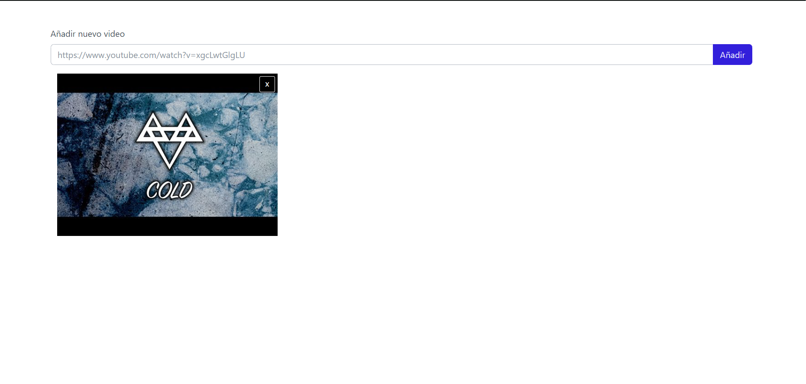
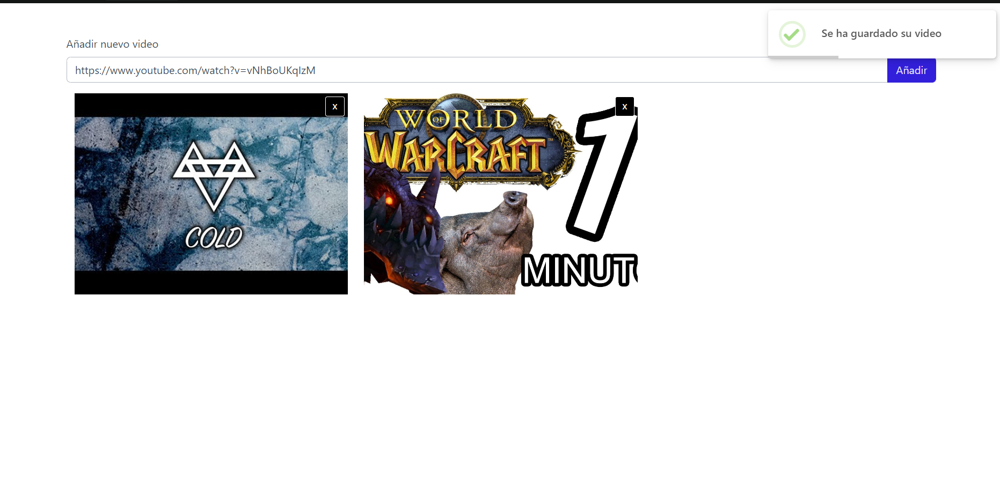
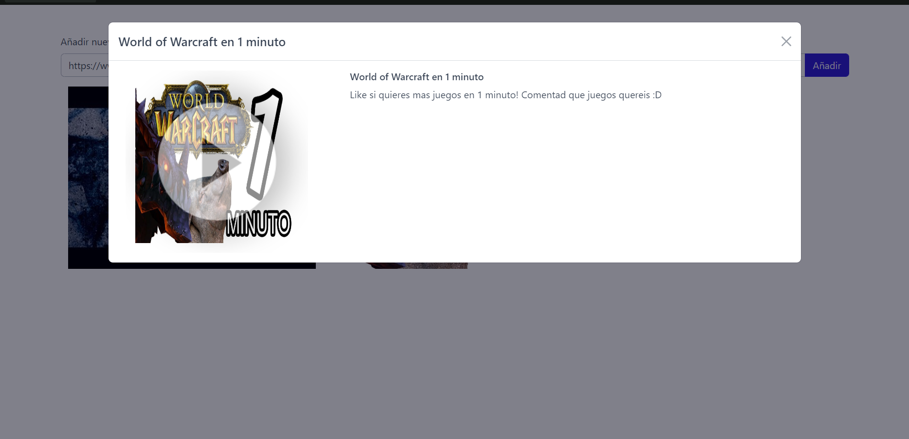
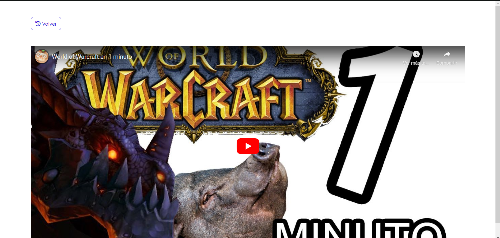

Album de videos de youtube realizado en nodejs y en vue3

<p align="center">
  
  
  
  
</p>

## Unit tests

Requirements:

* Node.js - [Install Node.js 14.x](https://nodejs.org/en/), including the npm package management tool.

Tests are defined in the \_\_tests__ folder in this project. Use `npm` to install the [Jest test framework](https://jestjs.io/) and run unit tests.

```bash
my-application$ npm install
my-application$ npm run test
```

## Resources

For an introduction to the AWS CDK specification, see the [AWS CDK Developer Guide](https://docs.aws.amazon.com/cdk/latest/guide/home.html).

Next, you can use the AWS Serverless Application Repository to deploy ready-to-use apps that go beyond Hello World samples and learn how authors developed their applications. For more information, see the [AWS Serverless Application Repository main page](https://aws.amazon.com/serverless/serverlessrepo/) and the [AWS Serverless Application Repository Developer Guide](https://docs.aws.amazon.com/serverlessrepo/latest/devguide/what-is-serverlessrepo.html).
